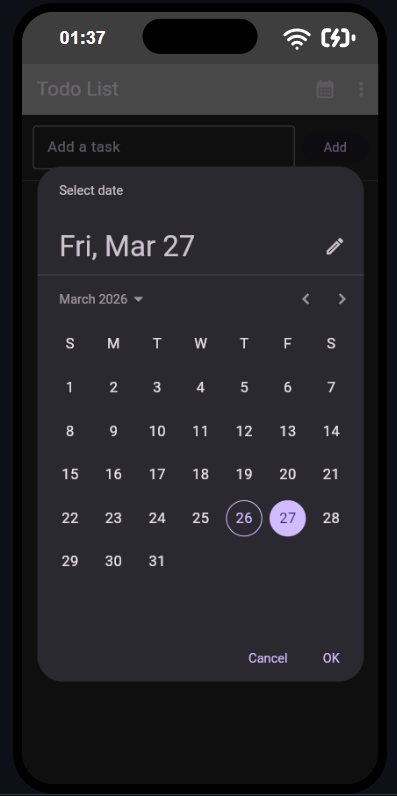
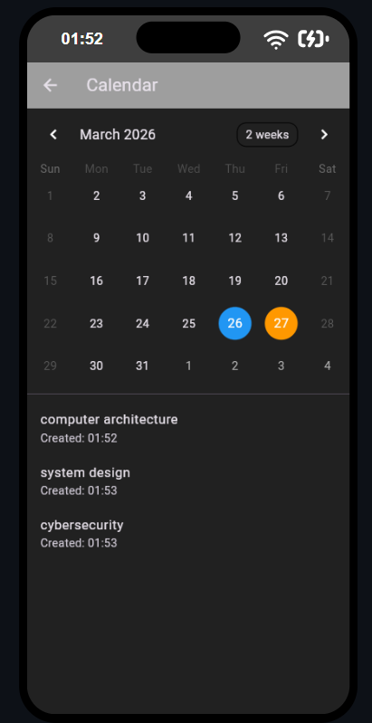

todo_flutter = provided version

todo_flutter_app = my upgraded version

# Scheduling feature

<table>
<tr>
<td align="center">

</td>
<td align="center">

</td>
</tr>
</table>

# Calendar Management

